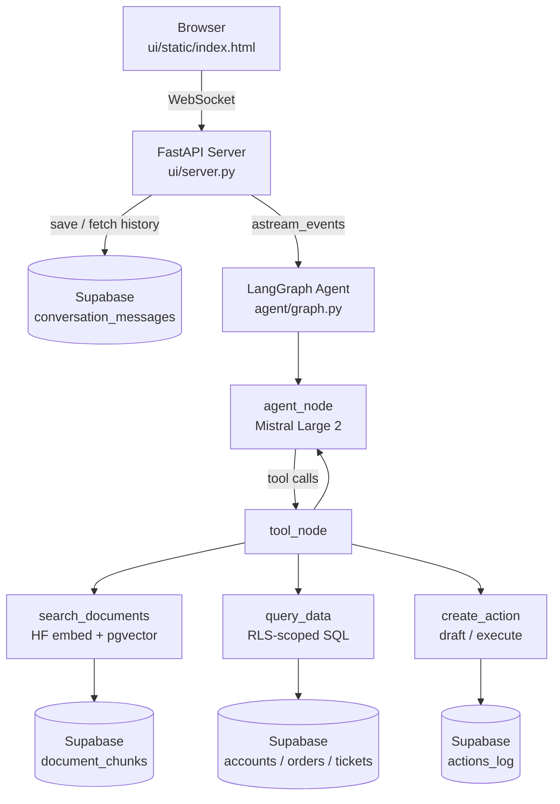
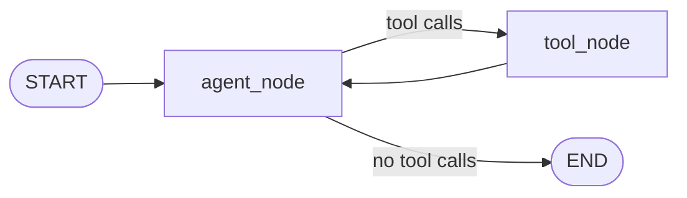
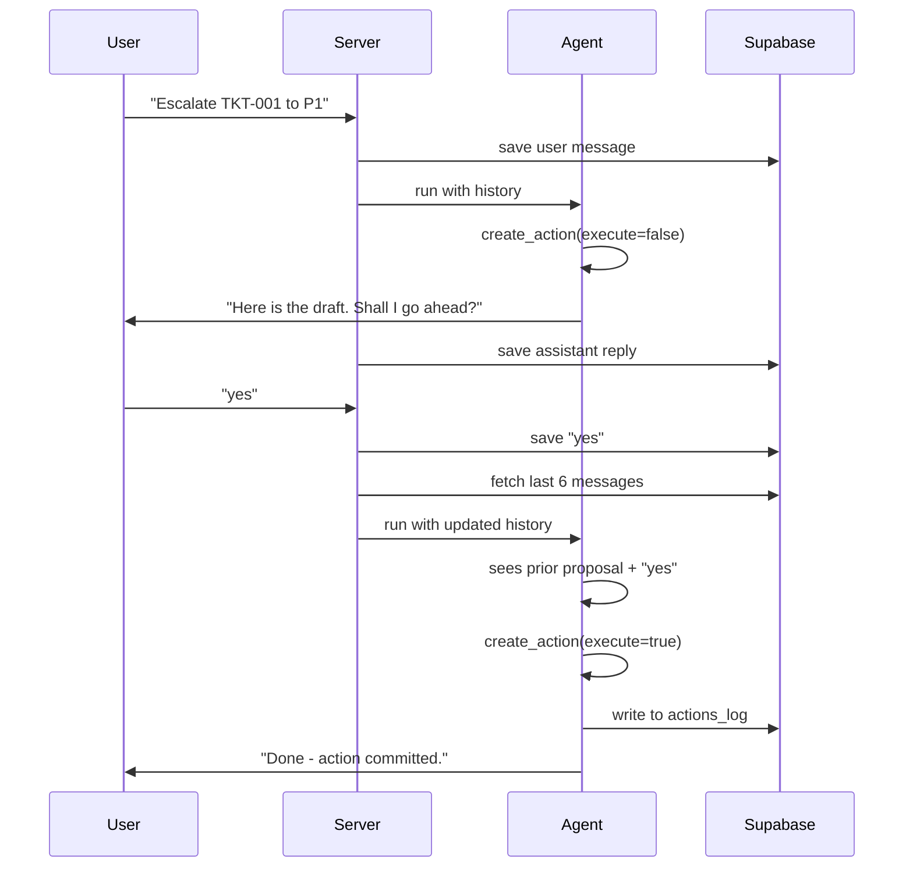

# ParcelPilot Support Agent

AI support agent for ParcelPilot's B2B logistics platform - CalQuity AI Engineer assessment submission.

**Stack:** Mistral Large 2 - LangGraph - FastAPI + WebSocket - HuggingFace Inference API (BAAI/bge-small-en-v1.5) - Supabase (pgvector + structured data + conversation history)

**Live:** https://parcelpilot-agent-79i2.onrender.com

---

## What Was Built

Both user contexts from the assessment spec in a single application:

- **Customer Portal** - account ID + PIN auth, scoped to the customer's own data, policy questions answered against their signed agreement first
- **Internal Ops** - staff password auth, cross-account access, proactive SLA scan on login, escalation with confirmation gate

---

## Architecture



### Agent loop



### Confirmation flow



---

## Minimum Requirements

| Requirement | Implementation |
|---|---|
| Natural-language chatbot | LangGraph + Mistral Large 2, streaming over WebSocket |
| Access control | Supabase RLS + Python account_id check on every query |
| Document search | `search_documents` - HF embed + pgvector cosine similarity |
| Structured data | `query_data` - order, account, ticket lookups scoped by role |
| State-changing action | `create_action` - escalate / update / task; writes to `actions_log` |
| Confirmation gate | `execute=false` draft on turn 1; `execute=true` only after DB-persisted "yes" on turn 2 |
| Multi-step requests | Agent chains tools freely: order lookup - account fetch - agreement search - SLA calc |
| Chat interface | Custom FastAPI WebSocket UI; real-time token streaming + tool-call pills |

---

## Source Authority Hierarchy

Documents are tagged `authority_level` (1-4) at ingestion. When sources conflict, the lower number wins.

| Level | Source | Rule |
|---|---|---|
| 1 - Highest | Customer agreements (Northstar, LumenWorks) | Overrides all other sources for that account |
| 2 | Support Policy v3 CURRENT (eff. 1 May 2026) | Default when no agreement applies |
| 3 | Cancellation SOP v4, Product Operations Guide | Cancellation rules, credits, known issues |
| 4 - Lowest | Historical ticket resolutions | Context only - may contain incorrect guidance |
| Blocked | Support Policy v2 DEPRECATED | Tagged `is_deprecated=true`; filtered out in SQL |

---

## Additional Problems Addressed

**Proactive issue detection** - on staff login, a background scan checks every open ticket against SLA targets, flags failed pickups, and clusters similar tickets by Jaccard similarity across accounts. Results are pushed as a panel before the first user turn.

**Trust and reliability** - three mechanisms: (1) structured `authority_level` integer makes conflict resolution deterministic; (2) conflict detection injects a flag when retrieved chunks from different tiers disagree, prompting the agent to explicitly state which source governed; (3) confirmation gate prevents any write without explicit user approval.

---

## Key Decisions

**DB-backed confirmation over a state machine** - saves every message to Supabase and lets the LLM read history on each turn. Survives server restarts; no routing logic required. Trade-off: one extra Supabase round-trip (~50ms).

**RLS as the enforcement layer** - Supabase RLS rejects cross-account rows at the database layer regardless of what the model is told. Python re-checks `account_id` before returning any row. Two independent guards. Trade-off: more schema setup.

**`authority_level` as a structured integer** - deterministic conflict resolution without prompt-engineering fragility. Deprecated documents are excluded in the SQL function, not filtered by the model. Trade-off: careful ingestion tagging required.

**Custom UI over Chainlit** - dual auth flow (customer PIN vs staff password) and the proactive scan panel needed full control over the WebSocket session model. Trade-off: more frontend work.

---

## What I Would Build Next

1. **Real ticket system integration** - connect `create_action` to Zendesk or Linear so escalations are actionable without copy-paste
2. **Feedback loop** - log staff conflict overrides as few-shot training signal
3. **Per-session memory** - summarise each resolved ticket in a vector table for "has this customer had this before?" queries
4. **Eval harness** - adversarial prompts on every deploy (prompt injection, cross-account requests, deprecated policy citations)

**Intentionally left out:** real email delivery on escalation (mocked as specified), multi-language support, fine-tuning (Mistral Large 2 zero-shot is accurate enough for this data volume).

**One metric to judge usefulness:** first-contact resolution rate - percentage of queries answered fully without human follow-up. Target: >60% on policy/SLA questions.

---

## Setup

**Prerequisites:** Python 3.11+, Supabase project with pgvector, Mistral AI API key, HuggingFace token

```bash
git clone https://github.com/SanskarBajaj123/ParcelPilot.git
cd ParcelPilot
pip install -r requirements.txt
cp .env.example .env  # fill in keys
```

Run `scripts/setup_supabase.sql` in the Supabase SQL editor, then:

```bash
python scripts/ingest.py   # chunk PDFs + embed + upsert (2-5 min)
python ui/server.py        # http://localhost:8000
```

---

## Test Credentials

**Customer Portal**

| Account | PIN |
|---|---|
| ACCT-001 (Northstar Logistics) | 1234 |
| ACCT-002 (LumenWorks) | 5678 |

**Internal Ops**

| Username | Password |
|---|---|
| priya | ParcelPilot@2026 |
| rohit | Support@2026! |

---

## AI Tool Usage

Built end-to-end with **Claude Code** (claude-sonnet-4-6): architecture, LangGraph graph, FastAPI server, Supabase schema/RLS/vector search, system prompt design, and test suite. All code was reviewed and run locally before commit. Design decisions (authority hierarchy, conflict detection, DB-backed confirmation) were made by me; Claude implemented them.
